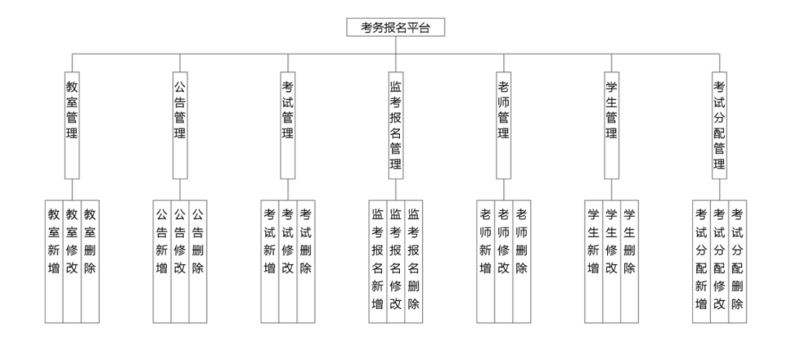
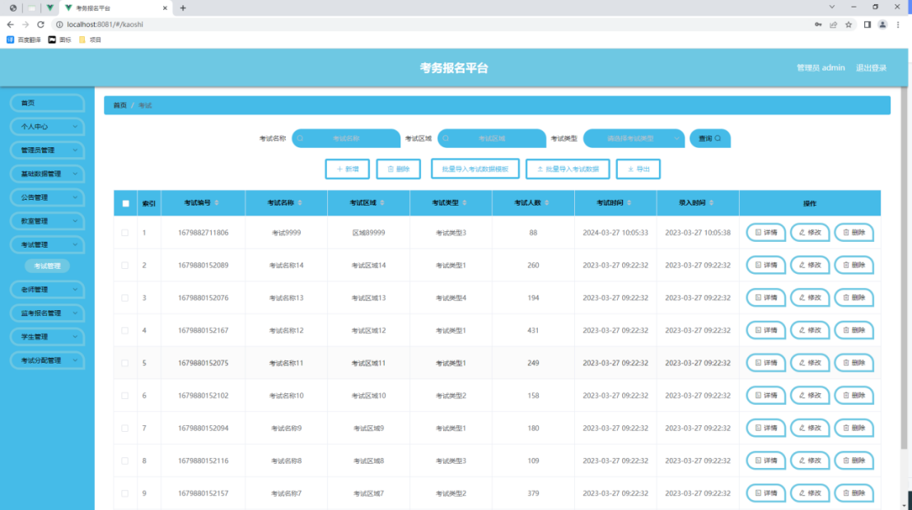
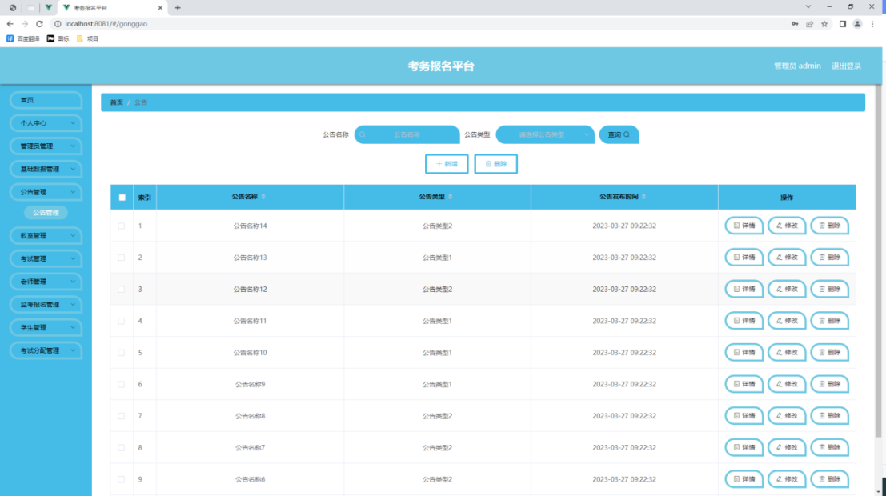
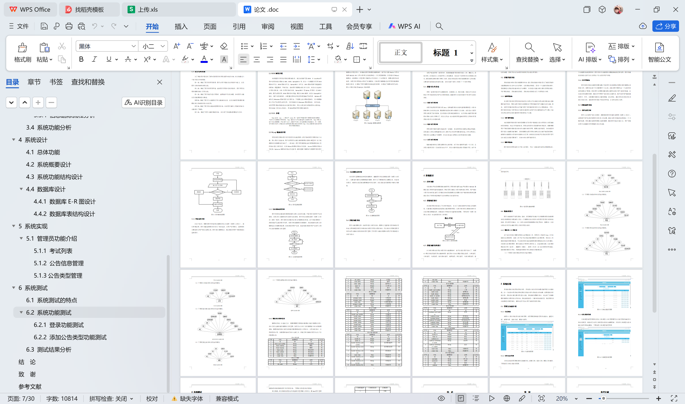

# springboot265-基于SpringBoot的考务报名平台

>  博主介绍：
>  Hey，我是程序员Chaers，一个专注于计算机领域的程序员
>  十年大厂程序员全栈开发‍ 日常分享项目经验 解决技术难题与技术推荐 承接各类网站设计，小程序开发，毕设等。
>  【计算机专业课程设计，毕业设计项目，Java，微信小程序，安卓APP都可以做，不仅仅是计算机专业，其它专业都可以】

## 3000套系统可挑选，获取链接：https://chaerspol.github.io/

<b>QQ【获取完整源码】：674456564</b>

<b>QQ群【获取完整源码】：1058861570</b>

### 系统架构

> 前端：html | js | css | jquery | vue
>
> 后端：springboot | mybatis
> 
> 环境：jdk1.8+ | mysql | maven

# 一、内容包括
包括有  项目源码+项目论文+数据库源码+答辩ppt+远程调试成功

# 二、运行环境

> jdk版本：1.8 及以上； ide工具：IDEA； 数据库: mysql5.7及以上；编程语言: Java

# 三、需求分析

**3.1 系统可行性分析**

开发一款程序软件不仅需要时间，也需要人力，物力资源。而进行可行性分析这个环节就是解决用户这方面的疑问，看看程序在当前的条件下是否可以进行开发。

**3.1.1 技术可行性分析**

此程序选用的开发语言是Java，这种编程语言有着丰富的数据类型，在指令控制语句上也比较完善，更重要的就是对类与对象的大力支持，这些优点为程序开发者提供了技术保障，尤其是现在代码都逐渐模块化，有关系统功能开发的源码在网络上都公开展示了，所以让具备一定计算机开发基础的开发人员独立开发系统在技术上也逐渐容易。

**3.1.2 经济可行性分析**

开发此程序最关键的设备就是一台电脑，无论是学校计算机室配备的电脑，还是自己入学以来购置的笔记本，都是可以符合开发要求的设备，另外在网络上，学校本已完全覆盖了校园网，所以在设备以及网络上无须考虑经济问题。

**3.1.3 运行可行性分析**

随着电脑软件以及配套硬件的完善升级，当下的计算机环境是一片大好，尤其是计算机已经广泛普及到家家户户，所以计算机设备现在是随处可见，由于本次开发的程序占有的资源耗费较小，在一般的电脑或笔记本上都能轻松运转起来。
通过上面的可行性描述，可以从经济，技术，运行方面解决程序开发是否可行的问题。因此可以认为该程序软件是可以进行开发的。

**3.2 系统性能分析**

系统性能分析也是比较重要的内容，进行系统性能分析就是为了确保系统的功能要能够在生活中运行使用时，达到规定的指标，因此一个完整的系统软件，是需要进行系统的性能分析这个步骤的。本次进行性能分析主要从易用性指标，可扩展性指标，系统健壮性指标，系统安全性指标这几个方面进行分析。

**3.2.1 易用性指标**

本次程序软件的开发的目的就是让使用者可以通过使用该软件提高信息数据的管理效率，同时该程序软件也需要针对不同的操作用户设置对应的功能，因此，此程序的操作流程应该尽量与用户日常操作软件的行为习惯相贴合，另外，程序软件的设计与开发也应考虑非计算机专业用户的计算机操作水平，要让大部分使用者都可以轻松操作程序提供的各个功能。

**3.2.2 可扩展性指标**

当前需要开发的程序软件是根据当下的用户需求进行设计开发的，但是随着时间的推移，社会大环境的改变，开发出的程序也是需要与时俱进的，需要根据用户不断变换的需求进行相应的功能内容的扩展，需要注意的就是，当对成型的程序进行功能模块新增时，仍然需要保证程序原有架构以及功能不能受到影响，新增的功能模块在系统中也能够运行正常，该指标达标也就可以保证此程序是可以在满足信息管理要求下，从容应对市场环境的变化。

**3.2.3 健壮性指标**

程序软件的开发就是为了投入使用时，可以一直稳定的处理各种数据信息，程序软件一旦不稳定，也会给使用者带来干扰。因此从性能分析的角度，就要要求程序软件在应对使用者的误操作，或者是使用者因为各种原因，填写有误的数据等情况时，程序要一直保持稳定，并能够正常让使用者进行使用。当程序的某个功能模块出现异常时，程序的其它功能模块也要能够确保正常使用。程序的健壮性指标达标可以让使用者产生良好的用户体验。

**3.2.4 安全性指标**

程序软件的安全问题是首要问题，毕竟程序对应数据库里面存放的数据信息是庞大的，里面也包括了许多重要的个人信息，这就对程序要具备一个完善的安全机制提出了要求。因此程序必须要设置登录功能用以进行用户身份的检查，以及身份和权限的匹配，通过对不同用户身份进行功能约束，绝不容忍用户越权操作程序。另外，也需要时刻防范计算机病毒，还有黑客，通过采取针对性的办法进行安全应对，确保程序时刻处于安全的环境，让使用者放心使用。

# 四、功能模块

在分析并得出使用者对程序的功能要求时，就可以进行程序设计了。如图展示的就是管理员功能结构图，管理员在后台主要管理教室管理、字典管理、公告管理、考试管理、监考报名管理、老师管理、学生管理、考试分配管理、管理员管理等。

# 五、效果图展示【部分效果图】

图5.1 考试列表页面【如图5.1显示的就是考试列表页面，此页面提供给管理员的功能有：查看考试、新增考试、修改考试、删除考试等。如图5.1显示的就是考试列表页面，此页面提供给管理员的功能有：查看考试、新增考试、修改考试、删除考试等。】

图5.2 公告信息管理页面【公告信息管理页面提供的功能操作有：新增公告，修改公告，删除公告操作。下图就是公告信息管理页面。】

图5.3 公告类型列表页面【公告类型管理页面显示所有公告类型，在此页面既可以让管理员添加新的公告信息类型，也能对已有的公告类型信息执行编辑更新，失效的公告类型信息也能让管理员快速删除。下图就是公告类型管理页面。】

 <b>完整文章</b>
 

 

## 3000套系统可挑选，获取链接：https://chaerspol.github.io/

<b>QQ【获取完整源码】：674456564</b>

<b>QQ群【获取完整源码】：1058861570</b>

